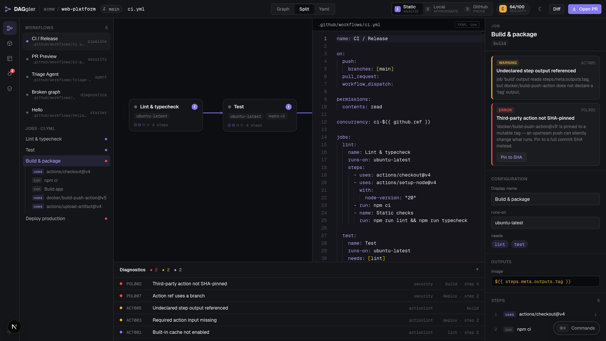
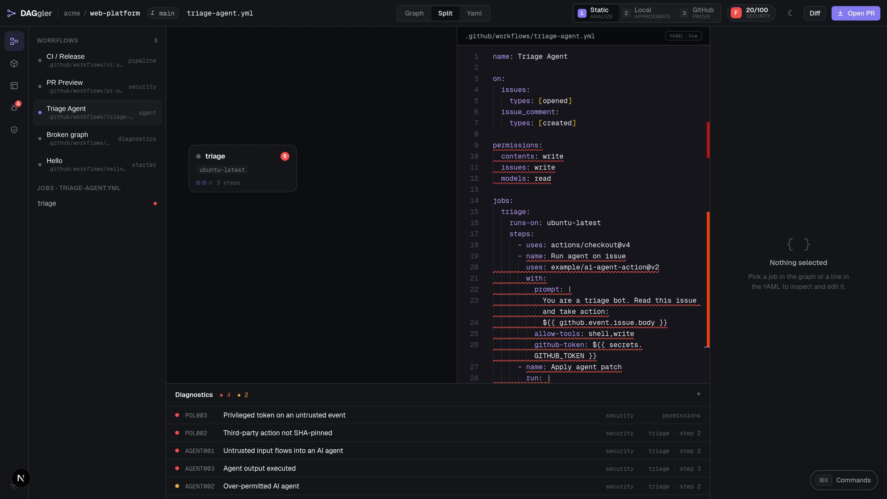
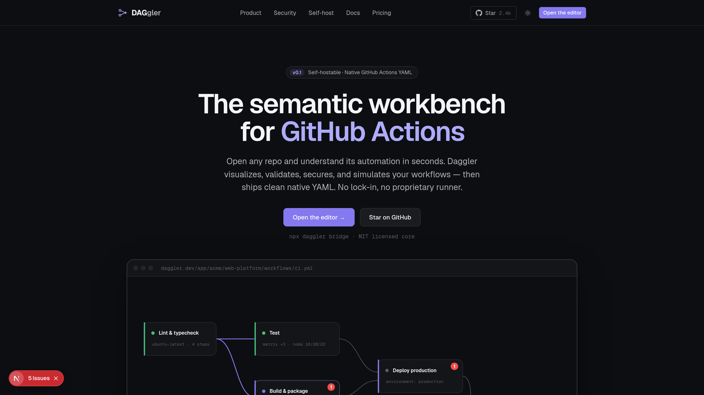
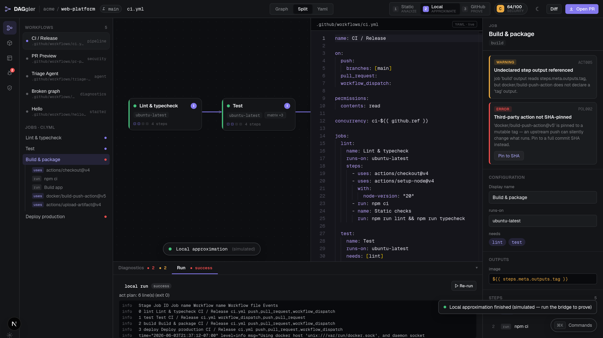

# Daggler

**A self-hostable semantic workbench for GitHub Actions.**

Daggler parses GitHub Actions YAML into a typed intermediate representation, projects it into a dependency graph, runs a layered validator against it, and surfaces the results in an interactive browser editor and a terminal linter. The entire semantic pipeline — parse, IR, graph, validate — is pure, isomorphic TypeScript that runs client-side with no backend required.

<p align="center">
  
</p>

<p align="center"><sub>The editor — a live job DAG, Monaco YAML with source-mapped diagnostics, a typed inspector, the confidence ladder, and one-click quick-fixes. Everything runs client-side on the real engine.</sub></p>

<table>
<tr>
<td width="50%"><br><sub align="center"><b>Security posture &amp; agentic-injection detection</b> — an AI-agent workflow graded <code>F</code>, with <code>AGENT001</code>/<code>POL003</code> findings.</sub></td>
<td width="50%"><br><sub align="center"><b>Self-hostable, no lock-in</b> — native GitHub Actions YAML in, native YAML out.</sub></td>
</tr>
</table>

<p align="center">
  
</p>

<p align="center"><sub>The confidence ladder is real. Clicking <b>Local</b> posts the workflow to a Next route handler that runs <code>act</code> against Docker and streams the actual plan into the editor's Run panel — honest "simulated until you connect a runner" labeling, never faked.</sub></p>

---

## Product thesis

GitHub Actions workflows are code. Daggler treats them that way:

- **Understand** — parse YAML into a structured IR and render the job DAG.
- **Author** — edit in Monaco or click nodes in the graph; patches are source-preserving (comments and formatting survive).
- **Validate** — five validation layers catch schema errors, malformed expressions, graph semantics violations, unknown action inputs, and security/policy findings.
- **Secure** — 13 built-in security and policy rules (POL001–POL010, AGENT001–AGENT003) covering unpinned actions, shell injection, privileged untrusted events, and agentic-workflow prompt injection.
- **Simulate** — the confidence ladder lets you run a static analysis pass instantly, then optionally forward to a local runner or GitHub for real execution.
- **Prove** — connect a self-hosted runner or GitHub App to move from "simulated" to "proved" execution status.
- **Export** — the patch engine serializes IR edits back to YAML and can resolve real, API-verified commit SHAs for pin-to-SHA quick-fixes.

---

## Monorepo layout

```
daggler/
├── apps/
│   ├── cli/                  # daggler lint / daggler bridge — terminal linter (tsup → Node ESM)
│   ├── web/                  # Next.js 15 + React 19 editor (runs engine client-side)
│   └── worker/               # Graphile Worker job registry (parse, validate, sync stubs)
├── packages/
│   ├── workflow-ir/          # parser → IR → graph → serialize → patches
│   ├── validators/           # 5-layer validator + policy engine + actions catalog
│   ├── runner-protocol/      # RunnerPort + confidence ladder (AnalyzerAdapter, ActAdapter, GitHubDispatchAdapter)
│   ├── github/               # GitHubRepositoryPort + InMemoryGitHubAdapter
│   └── db/                   # Drizzle ORM Postgres schema (self-host persistence)
├── ARCHITECTURE.md
├── CHANGELOG.md
├── pnpm-workspace.yaml
└── turbo.json
```

---

## Architecture overview

### `@daggler/workflow-ir`

The semantic core. Takes raw GitHub Actions YAML and produces:

1. **Parse** — YAML is parsed and normalized into a `WorkflowIR` (typed jobs, steps, triggers, permissions, matrix strategy, concurrency, outputs).
2. **Source map** — every IR node is mapped back to its byte offset in the original YAML so diagnostics carry accurate line/column spans.
3. **Graph** — `buildGraph` projects jobs + `needs` edges into a `WorkflowGraph` with pre-computed `depth` values for layout.
4. **Serialize** — `serialize` / `denormalize` round-trip an IR back to YAML.
5. **Patches** — `applyCommand` applies structured `EditorCommand`s (rename, set `runs-on`, set `uses`, etc.) to the raw YAML string while preserving comments and formatting. `pinActionToSha` replaces a mutable tag with a verified full SHA.

### `@daggler/validators`

Runs every layer over a `ParseResult` and returns a `ValidationResult` with typed `Diagnostic[]`, error/warning/info counts, a security posture score (0–100, graded A–F), and a complexity metric.

**Five validation layers:**

| Layer | Source tag | What it checks |
|---|---|---|
| Parser | `parser` | Syntax errors and warnings surfaced during YAML parsing |
| Schema | `actionlint` / `semantic` | Required fields, unknown keys, type mismatches |
| Expressions | `semantic` | Malformed `${{ }}` expressions, undefined contexts |
| Graph semantics | `semantic` | Undefined `needs` targets, unreachable jobs, output reference errors |
| Actions | `semantic` | Unknown inputs for cataloged actions, deprecated major versions, missing cache options |

**Policy engine (13 rules):**

| Code | Severity | Title |
|---|---|---|
| POL001 | warning | No top-level permissions block |
| POL002 | error | Third-party action not SHA-pinned |
| POL003 | error | Privileged token on an untrusted event |
| POL004 | error | Secret reachable from untrusted event |
| POL005 | warning | Broad `contents:write` on PR workflow |
| POL006 | warning | Deploy without environment gate |
| POL007 | error | Action ref uses a branch |
| POL008 | error | Shell injection from untrusted input |
| POL009 | warning | OIDC permission without a cloud step |
| POL010 | warning | Workflow modifies workflow files |
| AGENT001 | error | Untrusted input flows into an AI agent |
| AGENT002 | warning | Over-permitted AI agent |
| AGENT003 | error | Agent output executed |

Rules are organized into six built-in policy packs: `oss-maintainer`, `enterprise-least-privilege`, `release-hardening`, `ai-agent-safety`, `docker-publishing`, and `cloud-deploy`.

The actions catalog includes real, API-resolved commit SHAs for commonly-used actions (`actions/checkout`, `actions/setup-node`, `docker/build-push-action`, `aws-actions/configure-aws-credentials`, and others). Pin-to-SHA quick-fixes use these verified SHAs.

### `apps/web`

A Next.js 15 + React 19 single-page editor. The entire semantic pipeline runs in the browser — there is no validation server. Key panels:

- **Graph canvas** — SVG DAG rendered from job nodes and `needs` edges; bezier curves between cards, run-status dots, diagnostic severity badges.
- **Monaco YAML pane** — full Monaco Editor instance with the raw workflow source.
- **Inspector** — right-hand panel showing job/step properties, permissions, diagnostics, and action metadata (runtime, trust score). All inputs fire `applyEdit` commands that round-trip through the patch engine.
- **Diagnostics panel** — bottom panel listing all findings, sorted by severity then security source weight.
- **Command palette** — `⌘K` / `Ctrl-K` palette for navigating the workflow library and applying common actions.
- **Confidence ladder** — three rungs in the top bar (described below).
- **Sidebar** — workflows, actions catalog, templates, diagnostics, and policies tabs.

### `apps/cli`

The `daggler` CLI. Built with tsup into a self-contained Node ESM bundle.

```
daggler lint [paths...] [--json] [--quiet] [--no-color]
daggler help
daggler --version
daggler bridge   # (planned) starts the local runner bridge for nektos/act integration
```

Running `daggler lint` with no arguments scans `.github/workflows/`. If that directory does not exist, it falls back to the bundled sample workflows as a demo. With `--json` it emits a structured JSON array of per-file results. Exit code 1 when any errors are found.

### `@daggler/db`

A Drizzle ORM Postgres schema covering the full relational model for the self-hosted deployment: users, workspaces, GitHub App installations, repository tracking, workflow files and revisions, in-progress drafts, visual layouts, validation runs and diagnostics, the actions catalog, self-hosted runner registrations, execution tracking (runs / jobs / steps / logs), policy pack management, and reusable workflow templates. Not required for the standalone web editor.

---

## The confidence ladder

The top bar of the editor shows three rungs, implemented in `@daggler/runner-protocol`:

| Rung | Id | Adapter | Status |
|---|---|---|---|
| 1 | `static` | `AnalyzerAdapter` | Fully implemented. Runs `parseWorkflow` + `validateWorkflow` in-process; no external deps. Always available; updates live on every keystroke. |
| 2 | `local` | `ActAdapter` | Requires the `daggler bridge` with nektos/act and Docker. Until the bridge is running, reports `NotConnectedError`. Start with: `npx daggler bridge`. |
| 3 | `github` | `GitHubDispatchAdapter` | Requires a connected GitHub App. Results are authoritative ground truth. Until an App is installed and connected, reports `NotConnectedError`. |

Static analysis is fully functional today. Local and GitHub rungs report `NotConnectedError` with a clear message until the respective integrations are wired up; they never return fake results.

---

## Quickstart

**Prerequisites:** Node >= 20, pnpm >= 10.

```bash
# Clone and install dependencies (already installed in dev)
git clone https://github.com/alliecatowo/daggler
cd daggler
pnpm install
```

### Web editor

```bash
pnpm --filter @daggler/web dev
# Opens at http://localhost:3737
```

The editor loads with bundled sample workflows. No database or GitHub connection is needed.

### CLI

```bash
# Build the CLI
pnpm --filter daggler-cli build

# Lint your workflows (reads .github/workflows/ by default)
./apps/cli/dist/cli.js lint

# Or install globally
npm install -g ./apps/cli

daggler lint
daggler lint .github/workflows/ci.yml
daggler lint .github/workflows/ --json
daggler lint ci.yml deploy.yml --quiet
```

### Running tests

```bash
pnpm test
```

---

## What's verified

The following test suites pass and are treated as contracts. Do not break them.

| Package | Suite | Tests |
|---|---|---|
| `@daggler/workflow-ir` | `test/core.test.ts` | 17 tests covering parse structure, graph build, source map spans, serialize round-trip, and patch application |
| `@daggler/validators` | `test/validation.test.ts` | 20 tests covering all 13 policy/security rules, schema checks, expression validation, and the security posture score |

---

## Self-hosting with Docker

A `docker compose` setup is intended for teams that want to persist workflows, run server-side validation, and integrate the GitHub App. The `@daggler/db` schema targets Postgres.

```bash
# (Coming: docker compose up)
# Sets DATABASE_URL and starts the Next.js app against your Postgres instance.
```

The standalone web editor (no database, no GitHub App) requires only Node and a static file host.

---

## License

MIT. See [LICENSE](./LICENSE).

GitHub: https://github.com/alliecatowo/daggler
