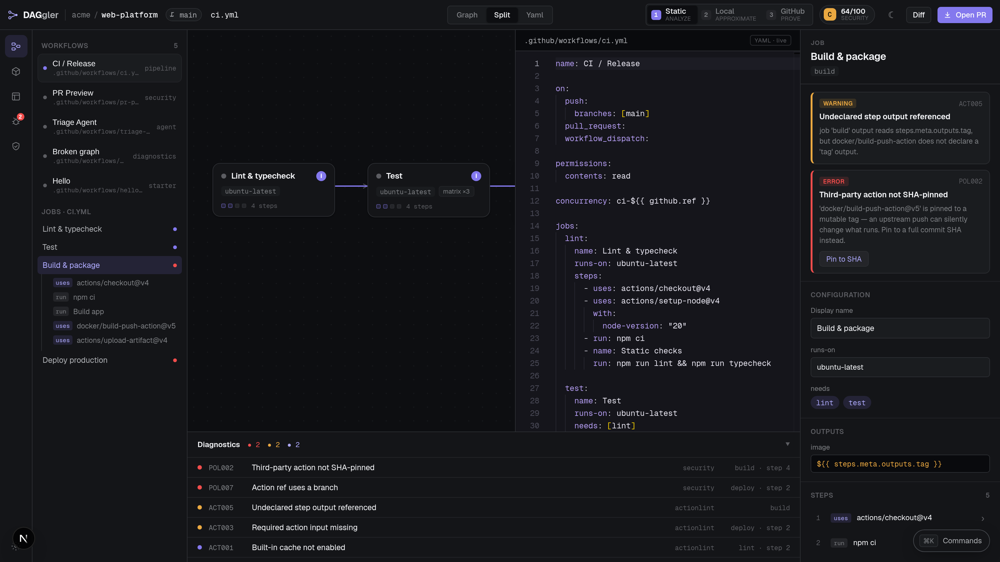
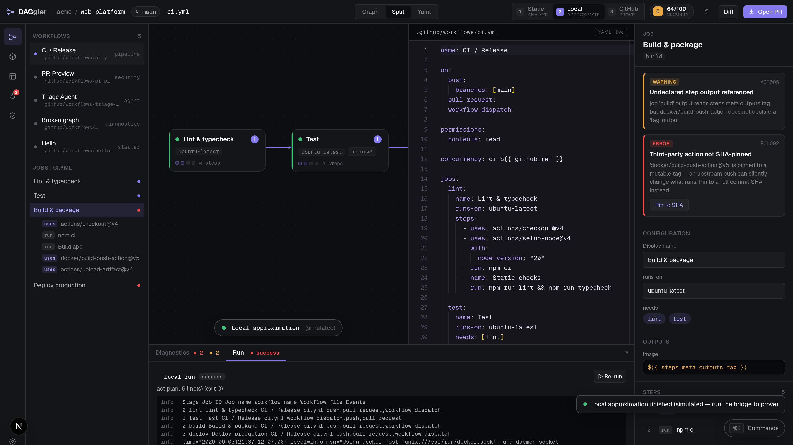

<h1><span class="dg-prompt">$</span> npx daggler-cli lint</h1>
<p class="dg-lede">Daggler is a semantic workbench for GitHub Actions. It parses workflows into a typed IR, graphs the jobs, validates them in layers and catches security problems before they ship.</p>
<div class="dg-actions">
  <a class="dg-primary" href="./guide/getting-started">get started</a>
  <a href="#install">install the cli</a>
  <a href="https://github.com/alliecatowo/daggler">github</a>
</div>

<div class="dg-term">
<div class="dg-term-bar">npx daggler-cli lint --no-color</div>
<pre><span class="c">.github/workflows/ci.yml</span>  <span class="r">Security D 58/100</span>
2 errors  ·  1 warning  ·  0 info
<span class="u">⚑ Unpinned third-party actions</span>
<span class="u">⚑ Shell injection risk</span>
<span class="r">●</span> <span class="p">POL007</span>  .github/workflows/ci.yml:8:9  Action ref uses a branch
<span class="m">└─ 'actions/checkout@main' tracks a moving branch — each run may execute different code. Pin to a release tag or a full commit SHA.</span>
<span class="r">●</span> <span class="p">POL008</span>  .github/workflows/ci.yml:9:9  Shell injection from untrusted input
<span class="m">└─ Untrusted 'github.event.pull_request.title' is interpolated into a shell script — an attacker can inject commands. Pass it via an env var and quote it instead.</span>
<span class="y">▲</span> <span class="p">POL001</span>  .github/workflows/ci.yml:workflow:permissions  No top-level permissions
<span class="m">└─ No top-level 'permissions:' block — the workflow inherits broad default token scopes; add an explicit least-privilege block.</span>
Summary  2 errors  ·  1 warning  ·  0 info  in 1 file  ·  worst security grade D</pre>
</div>

That is the actual output on a small workflow that checks out `actions/checkout@main` and interpolates a pull request title into a shell step under `pull_request_target`.

## what it does

<dl class="dg-facts">
  <dt>parse and graph</dt>
  <dd>Workflow YAML becomes a typed IR with a source map, then a job dependency graph. Diagnostics point at an exact line and column.</dd>
  <dt>five layers</dt>
  <dd>Parser, schema, expressions, graph semantics, and action inputs.</dd>
  <dt>13 policy rules</dt>
  <dd>POL001 to POL010 and AGENT001 to AGENT003: unpinned actions, shell injection, privileged untrusted events, and prompt injection in AI-agent workflows. Each workflow gets a score and a grade from A to F.</dd>
  <dt>source-preserving edits</dt>
  <dd>The patch engine applies edits to the YAML while keeping comments and formatting, and pin-to-SHA quick-fixes use API-verified commit SHAs.</dd>
  <dt>confidence ladder</dt>
  <dd>Run a static analysis pass, then optionally a local <code>act</code> run or a GitHub run. Results are labeled simulated until a real runner proves them.</dd>
  <dt>client-side</dt>
  <dd>The parse, graph and validate pipeline is pure TypeScript and runs in the browser with no backend.</dd>
</dl>

## the editor

Captures from the real editor running from a checkout, with the real engine and bundled sample workflows. There is no hosted editor, so these are screenshots rather than a live embed.

<div class="dg-shots">
<figure><figcaption>Live job graph, Monaco YAML with source-mapped diagnostics, a typed inspector and one-click quick-fixes.</figcaption></figure>
<figure><figcaption>Security view: an AI-agent workflow graded F, with AGENT001 and POL003 findings.</figcaption></figure>
<figure><figcaption>The Local rung of the confidence ladder runs act against Docker and streams the plan into the Run panel.</figcaption></figure>
</div>

<div id="install"></div>

## install

The CLI is published on npm as [`daggler-cli`](https://www.npmjs.com/package/daggler-cli) (Node 20 or newer). The binary is `daggler`.

```bash
npm install -g daggler-cli
daggler lint
```

Or without installing: `npx daggler-cli lint`.

The browser editor is not published as a package or a hosted service. Build and run it from source (Node 20+, pnpm 10+):

```bash
git clone https://github.com/alliecatowo/daggler
cd daggler
pnpm install
pnpm --filter @daggler/web dev
```

It opens at `http://localhost:3737` with bundled sample workflows. No database or GitHub connection is needed.

Details are in the [guide](/guide/getting-started) and the [reference](/reference/cli).
