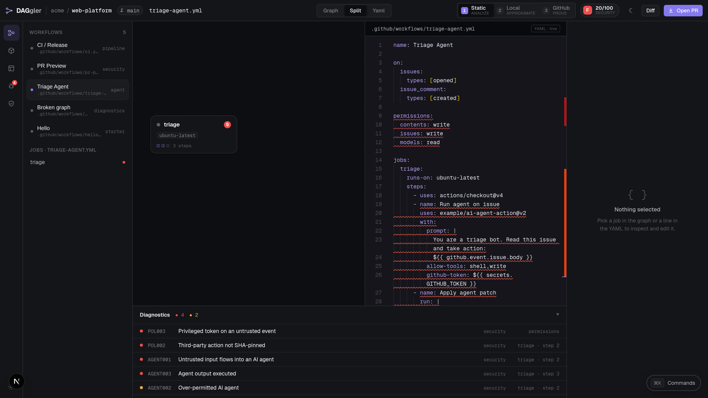

# Policy rules

Thirteen pure rules run over the parsed workflow, on top of the [five validation layers](/reference/validation). Each finding has a code, a severity, a source location and a message that says what to do. The findings feed a security score from 0 to 100, graded A to F per workflow (`F 0/100` for the example on the home page).

| Code | Severity | Title |
|---|---|---|
| POL001 | warning | No top-level permissions block |
| POL002 | error | Third-party action not SHA-pinned |
| POL003 | error | Privileged token on an untrusted event |
| POL004 | error | Secret reachable from untrusted event |
| POL005 | warning | Broad `contents:write` on PR workflow |
| POL006 | warning | Deploy without environment gate |
| POL007 | error | Action ref uses a branch |
| POL008 | error | Shell injection from untrusted input |
| POL009 | warning | OIDC permission without a cloud step |
| POL010 | warning | Workflow modifies workflow files |
| AGENT001 | error | Untrusted input flows into an AI agent |
| AGENT002 | warning | Over-permitted AI agent |
| AGENT003 | error | Agent output executed |

An *untrusted event* is one that runs with the base repository's privileges while handling content an outsider controls, such as `pull_request_target` or `issue_comment`.

## Permissions and tokens

### POL001: No top-level permissions block
Without an explicit `permissions:` block the workflow inherits the repository's default token scopes, which are often read-write. Declare the minimum at the top, then widen per job.

```yaml
permissions:
  contents: read
```

### POL003: Privileged token on an untrusted event
A job on `pull_request_target`, `issue_comment` and similar events that is granted write permissions can be driven by an attacker. Drop the write scope or move the privileged work to a workflow that does not process the outsider's content.

### POL005: Broad `contents:write` on PR workflow
A workflow triggered only by `pull_request` and holding `contents:write` is broader than it needs to be, and pull requests can come from external contributors. Prefer `contents: read` and do writes in a separate push or release workflow.

### POL009: OIDC permission without a cloud step
A job granting `id-token: write` with no recognised cloud-auth action probably has a permission it does not use. Remove it or add the cloud login step.

## Supply chain

### POL002: Third-party action not SHA-pinned
`uses: owner/action@v5` follows a mutable tag the action's author can move. Pin third-party actions to the full 40-character commit SHA (keep the tag in a comment). In the editor, the *Pin to SHA* quick-fix does this from API-verified SHAs.

### POL007: Action ref uses a branch
`uses: actions/checkout@main` runs different code on different days. Pin to a release tag or, better, a full commit SHA.

### POL010: Workflow modifies workflow files
A step that writes into `.github/workflows/` can change other workflows and bypass review gates or escalate privileges.

## Secrets and injection

### POL004: Secret reachable from untrusted event
When an untrusted event triggers the workflow and a step references a secret other than `GITHUB_TOKEN`, attacker-controlled code can exfiltrate it.

### POL008: Shell injection from untrusted input
Interpolating an attacker-controlled field such as `github.event.pull_request.title` straight into `run:` lets the author inject commands. Pass the value through an environment variable and quote it.

```yaml
- run: echo "Testing $TITLE"
  env:
    TITLE: ${{ github.event.pull_request.title }}
```

### POL006: Deploy without environment gate
A job that looks like a deploy (the name or id contains deploy, release, publish or promote; it uses a cloud-auth action; or it grants `id-token: write`) with no `environment:` has no required-reviewer protection. Add an `environment:` and configure reviewers in the repository settings.

## AI-agent workflows

### AGENT001: Untrusted input flows into an AI agent
Putting issue or pull request text directly into an agent's prompt on a privileged trigger enables prompt injection.

### AGENT002: Over-permitted AI agent
An agent step granted shell, write or exec tools together with a repository token has a large attack surface: a manipulated model response can run arbitrary actions.

### AGENT003: Agent output executed
A `run:` step that takes output from an earlier agent step and feeds it to `git apply`, `| sh`, `eval` or similar turns model output into code.

## Policy packs

Rules are grouped into six packs, so a team can switch on the set that matches its situation: `oss-maintainer`, `enterprise-least-privilege`, `release-hardening`, `ai-agent-safety`, `docker-publishing` and `cloud-deploy`.


